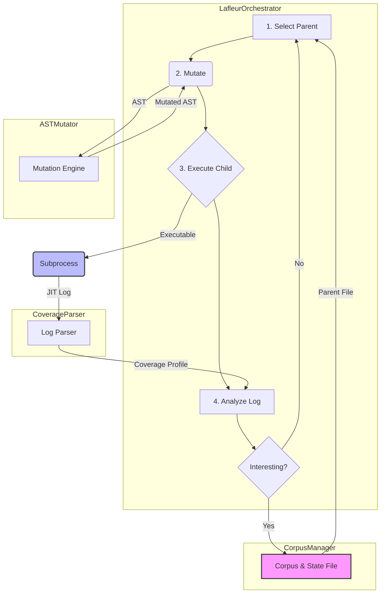

# Lafleur Developer Documentation: 01. Architecture Overview

### Introduction

**Lafleur** is a sophisticated, feedback-driven, evolutionary fuzzer designed specifically to find complex, state-dependent bugs and crashes in CPython's JIT compiler. It began as an advanced feature set within the `fusil` project and was spun off into a standalone tool to better focus on its specialized purpose.

Unlike purely generative fuzzers that create test cases from scratch in a "fire-and-forget" manner, `lafleur` uses a learning-based approach. It executes test cases, observes their effect on the JIT's behavior via detailed coverage analysis, and uses that information to guide its future mutations, becoming progressively smarter over the course of a fuzzing campaign.

### Core Philosophy: The Evolutionary Loop

The core of `lafleur` is an evolutionary, hill-climbing search algorithm that continuously performs a four-stage feedback loop.

1.  **Selection:** Intelligently select a promising "parent" test case from the existing corpus based on heuristics like performance, code complexity, and the rarity of the coverage it generates.
2.  **Mutation:** Apply a pipeline of advanced, Abstract Syntax Tree (AST)-based mutations to the parent, creating a new "child" variant. These mutations are often specifically designed to stress JIT compiler assumptions.
3.  **Execution:** Run the child test case in a monitored process with JIT logging enabled to capture its behavior.
4.  **Analysis:** Parse the logs to extract a coverage profile. If the child produced new and interesting JIT behavior (i.e., new coverage), it is added to the corpus to serve as a parent for future generations.

This cycle allows the fuzzer to iteratively build upon its successes, exploring deeper and more complex areas of the JIT's state space over time.

### High-Level System Diagram

The diagram below illustrates the main components of the `lafleur` fuzzer and the flow of data through the system.

### Module Breakdown

The `lafleur` project is organized into several distinct Python modules, each with a clear responsibility.

  * `lafleur/orchestrator.py`: The "brain" of the fuzzer. Contains the `LafleurOrchestrator` class, which manages the main evolutionary loop and coordinates all other components.
  * `lafleur/corpus_manager.py`: Handles all interactions with the on-disk corpus and the persistent state file (`coverage_state.pkl`). It is responsible for selecting parents, adding new files, and generating initial seeds.
  * `lafleur/coverage.py`: The "eyes" of the fuzzer. Contains the logic for parsing verbose JIT trace logs to extract the coverage feedback signal (uop edges and rare events).
  * `lafleur/mutator.py`: The "hands" of the fuzzer. Contains the `ASTMutator` engine and a rich library of `NodeTransformer` subclasses that perform both generic and highly-specialized, JIT-aware code mutations.
  * `lafleur/utils.py`: A collection of generic, reusable helper components, such as the `TeeLogger` for simultaneous console and file logging, and functions for managing run statistics.
  * `lafleur/state_tool.py`: A standalone command-line utility for inspecting and converting the binary `coverage_state.pkl` file into human-readable JSON.