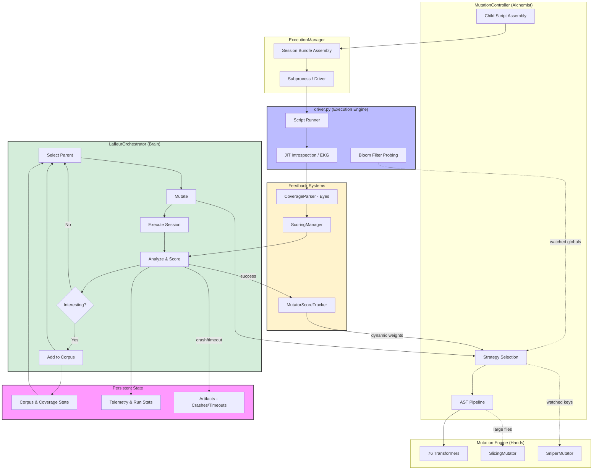

# Lafleur Developer Documentation: 01. Architecture Overview

### Introduction

**Lafleur** is a sophisticated, feedback-driven, evolutionary fuzzer designed specifically to find complex, state-dependent bugs and crashes in CPython's JIT compiler. It began as an advanced feature set within the `fusil` project and was spun off into a standalone tool to better focus on its specialized purpose.

Unlike purely generative fuzzers that create test cases from scratch in a "fire-and-forget" manner, `lafleur` uses a learning-based approach. It executes test cases, observes their effect on the JIT's behavior via detailed coverage analysis, and uses that information to guide its future mutations, becoming progressively smarter over the course of a fuzzing campaign.

### Core Philosophy: The Evolutionary Feedback Loop

The core of `lafleur` is an evolutionary, hill-climbing search algorithm that continuously performs a feedback loop with five stages.

1.  **Selection:** Intelligently select a promising "parent" test case from the existing corpus based on heuristics like performance, code complexity, and the rarity of the coverage it generates.
2.  **Mutation:** Apply a pipeline of advanced, Abstract Syntax Tree (AST)-based mutations to the parent, creating a new "child" variant. Mutation strategies are chosen adaptively, and can be targeted using JIT introspection data.
3.  **Execution:** Run the child test case in a monitored process with JIT logging enabled to capture its behavior. In session fuzzing mode, the child runs in a pre-polluted JIT environment.
4.  **Analysis:** Parse the logs to extract a coverage profile. If the child produced new and interesting JIT behavior (new coverage, new rare events, or increased JIT instability), it is added to the corpus.
5.  **Introspection:** The execution engine probes the JIT's internal state — Bloom filter contents, executor vitals, trace validity — feeding this data back into both the scoring system (to reward JIT stress) and the mutation engine (to enable targeted attacks via the Sniper strategy).

This cycle allows the fuzzer to iteratively build upon its successes, exploring deeper and more complex areas of the JIT's state space over time. For a detailed step-by-step walkthrough, see [02. The Evolutionary Loop](./02_the_evolutionary_loop.md).

### Session Fuzzing Architecture

To find deep, state-dependent bugs that only appear after prolonged execution or specific memory patterns, `lafleur` supports a **Session Fuzzing** mode (`--session-fuzz`).

In this mode, the fuzzer moves beyond executing isolated scripts. Instead, it constructs a **Session Bundle** — a sequence of scripts executed in a single, shared process. This preserves the JIT's internal state (traces, global watchers, memory layout) across script boundaries.

A typical session follows the "Mixer" strategy:

1.  **Polluters (The Mixer):** The session optionally begins by executing 1–3 random scripts from the corpus. These serve to "pollute" the JIT's cache, fill Bloom filters, and fragment the memory allocator, creating a hostile environment for the test case.
2.  **Warmup (The Parent):** The original parent script is executed to establish a known, "warm" JIT state.
3.  **Attack (The Child):** Finally, the mutated child script is executed. Because the JIT is already warm (and potentially unstable from the polluters), the child can trigger edge cases like "Zombie Traces" (Use-After-Free) or optimization invalidation bugs that isolated execution would miss.

If a crash occurs, `lafleur` saves the entire bundle (polluters, parent, and child) into a directory, ensuring exact reproducibility of the JIT state.

### High-Level System Diagram

The diagram below illustrates the main components and the flow of data through the system.

### Module Breakdown

The `lafleur` project is organized into modules with clear responsibilities. The orchestrator delegates most work to specialized managers.

#### The Orchestrator and Its Managers

* **`lafleur/orchestrator.py`** — The "brain" of the fuzzer. Contains the `LafleurOrchestrator` class, which manages the main evolutionary loop: parent selection, session coordination, deepening decisions, and corpus bootstrapping. It delegates specialized work to the managers below.

* **`lafleur/mutation_controller.py`** — "The Alchemist." The `MutationController` handles all mutation strategy selection and application. It consults the learning engine for strategy weights, applies the chosen pipeline (deterministic, havoc, spam, sniper, or helper+sniper), delegates to the `SlicingMutator` for large files, and assembles the final child script. See [04. The Mutation Engine](./04_mutation_engine.md) for details.

* **`lafleur/execution.py`** — The `ExecutionManager` runs child processes. In session fuzzing mode, it assembles session bundles (Mixer polluters + parent warmup + child attack), manages subprocess lifecycle, and handles timeout/crash detection.

* **`lafleur/scoring.py`** — The `ScoringManager` analyzes execution results. It parses coverage profiles, determines whether a child is "interesting" (new global or lineage-relative coverage), implements differential scoring that rewards JIT instability (high exit density), and performs duplicate detection via content and coverage hashing.

* **`lafleur/telemetry.py`** — The `TelemetryManager` tracks run statistics, logs time-series datapoints for campaign analysis, and generates corpus evolution stats (lineage depth, sterile rate, tree topology).

* **`lafleur/artifacts.py`** — The `ArtifactManager` saves crashes, timeouts, and divergences to disk with accompanying metadata and compressed logs.

#### Core Subsystems

* **`lafleur/driver.py`** — The execution engine. This standalone script runs within the subprocess and executes the fuzzing sessions. It includes the **JIT Introspection (EKG)** system, which uses `ctypes` to inspect internal C structs (`_PyExecutorObject`) in real-time, extracting vital metrics like exit density, zombie trace counts, and trace validity. It also performs **Bloom filter probing** to detect which globals and builtins the JIT is watching — this data feeds back into the Sniper mutation strategy.

* **`lafleur/coverage.py`** — The "eyes" of the fuzzer. Parses verbose JIT trace logs to extract the coverage feedback signal: stateful uop edges, rare events, and structural metrics (trace length, side exits). See [03. Coverage and Feedback](./03_coverage_and_feedback.md).

* **`lafleur/mutators/`** — The "hands" of the fuzzer. This package contains the `ASTMutator` engine (in `engine.py`) and a pool of 76+ `NodeTransformer` subclasses organized across five source modules: generic mutations, type system attacks, data model attacks, control flow attacks, and runtime state attacks. See [04. The Mutation Engine](./04_mutation_engine.md).

* **`lafleur/learning.py`** — The `MutatorScoreTracker`, an adaptive learning engine that scores mutation strategies and individual transformers based on their historical success. Uses epsilon-greedy selection with attempt-based decay, a grace period for new mutators, and a weight floor to ensure diversity.

* **`lafleur/corpus_manager.py`** — Handles all interactions with the on-disk corpus and the persistent coverage state (`coverage_state.pkl`). Responsible for parent selection (via the `CorpusScheduler`), adding new files, corpus pruning, and generating initial seeds via the fusil seeder.

* **`lafleur/utils.py`** — Reusable helpers including the `TeeLogger` for simultaneous console and file logging, and functions for managing run statistics.

#### Analysis & Triage Toolchain

These are installed CLI commands for monitoring fuzzing progress, aggregating multi-instance campaigns, and managing crash discoveries. For detailed usage, see [TOOLING.md](../../docs/TOOLING.md).

* **`lafleur/report.py`** (`lafleur-report`) — Generates health, coverage, and crash summaries for a single fuzzing instance.

* **`lafleur/campaign.py`** (`lafleur-campaign`) — Aggregates metrics from multiple instances into fleet-wide dashboards. Deduplicates crashes across instances and generates self-contained HTML reports with visualizations.

* **`lafleur/triage.py`** (`lafleur-triage`) — Interactive CLI for managing the crash registry: triage new crashes, link fingerprints to GitHub issues, record issue status, and import/export registry data.

* **`lafleur/registry.py`** — SQLite-based crash fingerprint registry. Tracks crash sightings, triage status, and links to reported CPython issues.

* **`lafleur/metadata.py`** — Generates `run_metadata.json` capturing hardware stats, build flags, CPython version, and environment details for every fuzzing run.

#### Standalone Tools

* **`lafleur/minimize.py`** — The **Session Minimizer**. Takes a complex multi-script crash bundle and reduces it to a single Minimal Reproducible Example (MRE) using `ShrinkRay` and crash fingerprinting.

* **`lafleur/state_tool.py`** — Utility for inspecting, migrating, and dumping the binary `coverage_state.pkl` file.

* **`lafleur-jit-tweak`** (installed script, in `lafleur/jit_tuner.py`) — Modifies CPython's internal JIT thresholds (`JIT_THRESHOLD`, `trace_stack_size`) to make the JIT more aggressive and easier to fuzz.

* **`lafleur/lineage.py`** (`lafleur-lineage`) — **Lineage Visualization Tool**. Generates Graphviz DOT graphs from the corpus's `parent_id` relationships. Supports ancestry tracing (including multi-lineage session crash ancestry), descendant trees, MRCA computation, and corpus forest overview. Computes structural metrics (Strahler stream order, branching factor, imbalance) and supports interactive HTML output with SVG pan/zoom.

* **`lafleur/bump_version.py`** — Maintenance script for updating the project version across `pyproject.toml` and `__init__.py`.