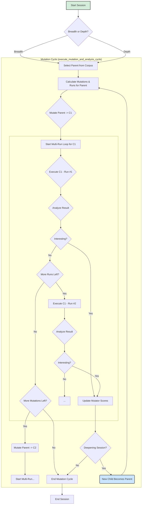

# Lafleur Developer Documentation: 02. The Evolutionary Loop

### Introduction

The core of `lafleur` is its evolutionary loop, managed by the `LafleurOrchestrator` class in `orchestrator.py`. This document provides a detailed walkthrough of a single fuzzing "session".

The loop is now a highly adaptive process. For each session, it makes a probabilistic choice between a **breadth-first** strategy (exploring a wide variety of parents from the corpus) and a **depth-first** "deepening" strategy (aggressively mutating a single promising lineage). Furthermore, the selection of mutation strategies is no longer static; it is guided by a learning engine that tracks the historical success of each mutator. Finally, to handle non-deterministic bugs, each mutated child can be executed multiple times.

### Flowchart of a Fuzzing Session

The following diagram illustrates the complete logical flow, including the deepening and multi-run execution loops.

### **Step-by-Step Analysis of a Fuzzing Session**

The modern lafleur session is a dynamic, multi-stage process. The following steps detail the complete lifecycle, combining the foundational evolutionary model with the newer adaptive and non-deterministic strategies.

### Step 1: Parent and Strategy Selection

The fuzzing session begins in the `run_evolutionary_loop` method. The first step is to choose a parent test case to serve as the genetic material for this session's mutations.

  * **Scoring:** The orchestrator calls upon the `CorpusManager`, which uses a `CorpusScheduler` to calculate a "fuzzing score" for every file in the corpus. This score is a floating-point number derived from several heuristics:
      * **Performance:** Files that are smaller and execute faster are penalized less.
      * **Rarity:** Files that contain coverage features (specifically, stateful uop edges) that are globally rare receive a significant score bonus.
      * **Fertility:** Files that have historically produced many "interesting" children are considered more "fertile" and are rewarded. Conversely, files that have been mutated many times without producing new discoveries are marked as "sterile" and are heavily penalized.
      * **Depth:** Files that are the result of a long, successful chain of mutations (a deep lineage) receive a small score bonus to encourage exploration of deep states.
      * **Structural Feedback:** Files that produce longer JIT traces and a higher number of side-exits are rewarded, as this indicates they are exercising the optimizer more thoroughly.
  * **Selection:** The orchestrator performs a weighted random selection on the corpus, where the weight for each file is the score calculated by the scheduler. This ensures that while high-scoring parents are heavily favored, lower-scoring ones still have a chance to be chosen, preventing stagnation.
  * **Strategy Choice:** Once a parent is selected, the orchestrator makes a probabilistic choice. With a 20% chance, the session is designated a **depth-first "deepening" session**; otherwise, it's a standard **breadth-first session**.

### Step 2: Adaptive Mutation

With a parent and a strategy selected, the orchestrator reads the parent's source code and parses its "core" part into an Abstract Syntax Tree (AST). The `base_harness_node` (e.g., `uop_harness_f1`) is identified and passed to the `apply_mutation_strategy` method.

  * **Adaptive Strategy Selection:** This method no longer uses hardcoded weights. It consults the `MutatorScoreTracker` from `lafleur/learning.py` to get dynamic weights for each high-level strategy based on their recent success in finding new coverage. It then probabilistically chooses one of the following:
      * **Deterministic:** Applies a small (1-3) number of seeded transformations.
      * **Havoc:** Applies a large number (15-50) of different, randomly chosen transformations.
      * **Spam:** Applies the same transformation 20-50 times to aggressively exercise a single mutator.
  * **Code Normalization & Sanitization:** Before applying the chosen strategy, a `FuzzerSetupNormalizer` is run on the parent's AST to remove any fuzzer-injected code from previous generations. After the mutation is applied, a final `EmptyBodySanitizer` pass ensures no control flow statements have empty bodies, preventing `IndentationError` crashes.

The result of this phase is a new, mutated AST for the harness function.

### Step 3: Multi-Run Child Execution

The orchestrator takes the mutated harness AST and reassembles the full script for the child test case. It creates a complete copy of the parent's AST and replaces the old harness function with the newly mutated one. The final tree is then **unparsed** back into a string of Python code.

  * **Multi-Run Loop:** To handle non-deterministic bugs, the orchestrator enters an inner loop to execute the child multiple times. The number of runs can be a static value from the `--runs` flag or a dynamic value calculated from the parent's score if `--dynamic-runs` is used.
  * **Reproducible Non-determinism:** For each run, a unique but deterministic **`runtime_seed`** is generated. This seed is injected into the child's script to initialize an internal `fuzzer_rng` object. This allows any `if fuzzer_rng.random() < ...:` branches to behave differently on each run, while ensuring the entire process can be reproduced.
  * **Subprocess Execution:** The code is written to a temporary file and executed in an isolated `subprocess`. Critically, the subprocess is launched with the necessary environment variables (`PYTHON_JIT=1`, `PYTHON_LLTRACE=4`, etc.) to enable the JIT and capture its verbose debug logs. The orchestrator waits for the process to complete (or time out) and captures its results.

### Step 4: Analysis, Corpus Update, and Loop Control

The result of each run is passed to the `analyze_run` method, which performs the final, critical steps:

1.  **Error Checking:** It first checks for correctness divergences (if in differential mode) or crashes by scanning the log file for keywords and checking the exit code. If an error is found, the test case is saved to the appropriate directory (`divergences/` or `crashes/`), and the analysis for that run concludes.
2.  **Coverage Parsing:** If no crash occurred, `parse_log_for_edge_coverage` is called on the log file to extract the child's coverage profile.
3.  **Interestingness Check:** The orchestrator performs its two-pass analysis, comparing the child's coverage against the **global coverage map** and the parent's **lineage coverage profile** to determine if any new coverage has been found.
4.  **Duplicate Check:** A child is now considered a duplicate only if it has both the same **`content_hash`** and the same **`coverage_hash`** as a previously seen test case. This allows the fuzzer to save multiple copies of the same source file if they produce different behaviors.
5.  **Corpus Commit & Loop Control:** If a child is both interesting and unique, the process proceeds:
      * The `MutatorScoreTracker` is notified of the success, increasing the scores of the mutators that were used.
      * The new coverage is added to the in-memory `global_coverage` map.
      * The `CorpusManager` saves the new test case to the corpus and updates the `coverage_state.pkl` file.
      * **If in a Breadth-first Session:** The `break` from `_handle_analysis_data` causes the entire `execute_mutation_and_analysis_cycle` method to exit. The main loop then starts a new session with a new parent.
      * **If in a Depth-first Session:** The new child immediately becomes the **new parent** for the current session. The `execute_mutation_and_analysis_cycle` method loops back and begins mutating this new file, continuing the "deepening" run.
