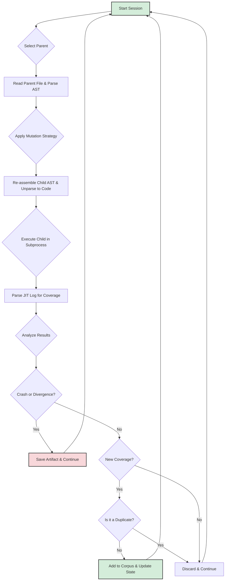

# Lafleur Developer Documentation: 02. The Evolutionary Loop

### Introduction

The core of `lafleur` is its evolutionary loop, managed by the `LafleurOrchestrator` class in `orchestrator.py`. This document provides a detailed, step-by-step walkthrough of a single fuzzing session, tracing the lifecycle of a test case from parent selection to the potential creation of a new, interesting child. This entire process is encapsulated within the `execute_mutation_and_analysis_cycle` method.

### Flowchart of a Fuzzing Session

The following diagram illustrates the complete logical flow of a single iteration of the fuzzer's main loop.

### Step 1: Parent Selection

The fuzzing session begins in the `run_evolutionary_loop` method, which calls upon the `CorpusManager` to select a parent test case. This selection is not random; it is a carefully guided process orchestrated by the `CorpusScheduler`.

  * **Scoring:** The scheduler first calculates a "fuzzing score" for every file in the corpus. This score is a floating-point number derived from several heuristics:
      * **Performance:** Files that are smaller and execute faster are given a higher score.
      * **Rarity:** Files that contain coverage features (specifically, uop edges) that are globally rare receive a significant score bonus.
      * **Fertility:** Files that have historically produced many "interesting" children that were added to the corpus are considered more "fertile" and are rewarded. Conversely, files that have been mutated many times without producing new discoveries are marked as "sterile" and are heavily penalized.
      * **Depth:** Files that are the result of a long, successful chain of mutations (a deep lineage) receive a small score bonus to encourage exploration of deep states.
  * **Selection:** The orchestrator performs a weighted random selection on the corpus, where the weight for each file is the score calculated by the scheduler. This ensures that while high-scoring parents are heavily favored, lower-scoring ones still have a chance to be chosen, preventing stagnation.

### Step 2: Mutation

Once a parent is selected, the orchestrator reads its source code and parses the "core" part (without boilerplate) into an Abstract Syntax Tree (AST). The `base_harness_node` (the `uop_harness_f1` function) is identified and passed to the `apply_mutation_strategy` method.

This method probabilistically chooses one of several mutation strategies for that run:

  * **Deterministic:** Applies a small (1-3) number of seeded transformations. This is the most common strategy.
  * **Havoc:** Applies a large number (15-50) of different, randomly chosen transformations to create a significantly different child.
  * **Spam:** Applies the same transformation 20-50 times to aggressively exercise a single mutation type.

The result of this phase is a new, mutated AST for the harness function.

### Step 3: Child Execution

The orchestrator takes the mutated harness AST and reassembles the full script for the child test case. It creates a complete copy of the parent's AST and replaces the old harness function with the newly mutated one. The final tree is then **unparsed** back into a string of Python code.

This code is written to a temporary file and executed in an isolated `subprocess`. Critically, the subprocess is launched with the necessary environment variables (`PYTHON_JIT=1`, `PYTHON_LLTRACE=4`, etc.) to enable the JIT and capture its verbose debug logs. The orchestrator waits for the process to complete (or time out) and captures its return code, stdout, and stderr.

### Step 4: Analysis and Corpus Update

The result of the execution is passed to the `analyze_run` method, which performs the final, critical steps:

1.  **Error Checking:** It first checks for correctness divergences (if in differential mode) or crashes by scanning the log file for keywords like `JITCorrectnessError` and checking the process's exit code. If an error is found, the test case is saved to the appropriate directory (`divergences/` or `crashes/`), and the analysis stops.
2.  **Coverage Parsing:** If no crash occurred, `parse_log_for_edge_coverage` is called on the log file to extract the child's coverage profile.
3.  **Interestingness Check:** The orchestrator then performs its two-pass analysis. In the first, read-only pass, it compares the child's coverage profile against the **global coverage map** and the parent's **lineage coverage profile** to determine if any new coverage has been found.
4.  **Duplicate Check:** If the child is deemed interesting, its SHA256 hash is calculated and checked against the set of all known hashes. If the hash already exists, the file is a duplicate and is discarded, ending the session.
5.  **Corpus Commit:** If the child is both interesting and unique, the analysis proceeds to the "commit" phase. The new coverage it discovered is added to the in-memory `global_coverage` map. The `CorpusManager` is then called to save the new test case to the corpus directory with a new integer ID and to update the `coverage_state.pkl` file with its metadata. This new file is now part of the corpus and can be selected as a parent in future sessions.
