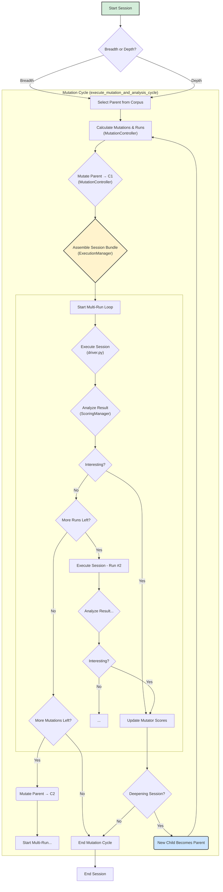

# Lafleur Developer Documentation: 02. The Evolutionary Loop

### Introduction

The core of `lafleur` is its evolutionary loop, managed by the `LafleurOrchestrator` class in `orchestrator.py`. This document provides a detailed walkthrough of a single fuzzing "session."

The loop is a highly adaptive process. For each session, the orchestrator makes a probabilistic choice between a **breadth-first** strategy (exploring a wide variety of parents from the corpus) and a **depth-first** "deepening" strategy (aggressively mutating a single promising lineage). The selection of mutation strategies is guided by a learning engine, and the execution phase can run complex **multi-script sessions** to stress the JIT's state persistence.

For the high-level architecture, see [01. Architecture Overview](./01_architecture_overview.md). For coverage signal details, see [03. Coverage and Feedback](./03_coverage_and_feedback.md).

### Flowchart of a Fuzzing Session

The following diagram illustrates the complete logical flow, including session construction, differential scoring, and manager delegation.

-----

### Step-by-Step Analysis of a Fuzzing Session

### Step 1: Parent and Strategy Selection

The fuzzing session begins in the `run_evolutionary_loop` method. The first step is to choose a parent test case to serve as the genetic material for this session's mutations.

  * **Scoring:** The orchestrator calls upon the `CorpusManager`, which uses a `CorpusScheduler` to calculate a "fuzzing score" for every file in the corpus. This score is a floating-point number derived from several heuristics:
      * **Performance:** Files that are smaller and execute faster are penalized less.
      * **Rarity:** Files that contain coverage features (specifically, stateful uop edges) that are globally rare receive a significant score bonus.
      * **Fertility:** Files that have historically produced many "interesting" children are considered more "fertile" and are rewarded. Conversely, files that have been mutated many times without producing new discoveries are marked as "sterile" and are heavily penalized.
      * **Depth:** Files that are the result of a long, successful chain of mutations (a deep lineage) receive a small score bonus to encourage exploration of deep states.
      * **JIT Instability:** Files that have previously demonstrated high JIT "Tachycardia" (high exit density) are rewarded to encourage further stress testing of that instability.
  * **Selection:** The orchestrator performs a weighted random selection on the corpus, where the weight for each file is the score calculated by the scheduler.
  * **Strategy Choice:** Once a parent is selected, the orchestrator makes a probabilistic choice (default 20%) to enter a **depth-first "deepening" session**, where the loop will immediately switch to mutating any interesting child found, creating deep lineages rapidly. Deepening sessions have a sterility limit (`DEEPENING_STERILITY_LIMIT = 30`): if no new coverage is found after 30 consecutive mutations, the session abandons the lineage and returns to breadth-first search.

### Step 2: Adaptive Mutation

With a parent selected, the orchestrator delegates mutation to the `MutationController` (in `mutation_controller.py`). The controller reads the parent's source code, extracts the harness function's AST, and applies a mutation pipeline.

* **Code Normalization:** A `FuzzerSetupNormalizer` removes old setup code (stale imports, previous `fuzzer_rng` initialization), and an `EmptyBodySanitizer` ensures no control flow statements have empty bodies.

* **Adaptive Strategy Selection:** The controller consults the `MutatorScoreTracker` to get dynamic weights for each of the five high-level strategies:
    * **Deterministic** — 1–3 seed-controlled random transformers.
    * **Havoc** — 15–50 weighted-random transformers from the full pool.
    * **Spam** — 20–50 applications of a single transformer.
    * **Sniper** — Targeted invalidation of Bloom-filter-detected watched globals. Requires `watched_keys` from the parent's metadata (populated by the driver's JIT introspection in a previous generation).
    * **Helper+Sniper** — Injects `_jit_helper_*` functions, then attacks them with the Sniper mutator. Always available because it generates its own targets.

    The Sniper strategy is only available when the parent's metadata contains `watched_keys` from a previous JIT introspection pass. See [04. The Mutation Engine](./04_mutation_engine.md) for details on each strategy and the transformer pool.

* **Slicing Optimization:** If the parent's function body exceeds 100 statements, the `SlicingMutator` applies the pipeline to a random 25-statement slice rather than the full AST.

The result of this phase is a new, mutated AST for the harness function, which the controller assembles into a complete child script by reattaching the boilerplate and setup code.

### Step 3: Session Assembly and Execution

The `ExecutionManager` (in `execution.py`) assembles the execution context. In session fuzzing mode, this means constructing a **Session Bundle** to test state persistence and JIT cache coherency.

1. **The Mixer (Pollution):** With a configurable probability, the execution manager selects 1–3 random "polluter" scripts from the corpus. These are prepended to the session to fill Bloom filters, fragment memory, and stress the JIT's global watchers before the test even begins.
2. **The Warmup:** The original **Parent** script is added to the bundle. Running it first ensures the JIT has "warmed up" traces relevant to the lineage.
3. **The Attack:** The mutated **Child** script is added last. It attacks the JIT state established by the previous scripts.

The execution manager then runs this bundle using the `lafleur.driver` module. The driver runs all scripts sequentially in a **single shared process**, ensuring that JIT traces, type feedback, and memory layouts persist from the polluters/parent to the child.

**JIT Introspection (The EKG):** During execution, the driver uses `ctypes` to inspect the internal `_PyExecutorObject` structs of the JIT. It records:
  * **Absolute vitals:** executor count, zombie traces (`pending_deletion`), valid/warm trace counts, maximum exit count, maximum chain depth, minimum code size, and maximum exit density.
  * **Delta vitals (session mode):** child-isolated measurements that subtract the parent/polluter baseline — `delta_max_exit_density`, `delta_total_exits`, `delta_new_executors`, `delta_new_zombies`. These delta metrics isolate the child's effect from the inherited JIT state.

**Bloom Filter Probing:** The driver also probes the JIT's internal Bloom filter to detect which globals and builtins the JIT is actively watching. This list of `watched_dependencies` is saved in the child's metadata and used by the Sniper strategy in future generations, closing the introspection → mutation feedback loop.

### Step 4: Analysis, Scoring, and Feedback

The result of the session is passed to the `ScoringManager` (in `scoring.py`). This is a multi-stage process that determines whether the child is worth keeping.

**1. Error Checking & Crash Handling:**
  * If a crash occurs, the `ArtifactManager` saves the **entire session bundle** (polluters, parent, child) into a directory (e.g., `crashes/session_crash_123/`), along with a `reproduce.sh` script for deterministic reproduction and a `metadata.json` containing a **crash fingerprint** (generated by `CrashFingerprinter` in `analysis.py`). The fingerprint enables deduplication across runs via the triage system.
  * Timeouts are similarly saved with compressed logs.

**2. Coverage & Vitals Parsing:**
  * The log file is parsed by the `CoverageParser` (see [03. Coverage and Feedback](./03_coverage_and_feedback.md)) to extract the coverage profile: stateful uop edges, unique uops, and rare events.
  * The JIT Vitals (absolute and delta) are extracted from the driver's introspection output.

**3. Interestingness Scoring:**

The `InterestingnessScorer` evaluates the child using a multi-factor scoring system. A child must score at least `MIN_INTERESTING_SCORE` (10.0) to be added to the corpus.

  * **Global coverage** (heaviest weight): new global edges (×10), new global uops (×5), new global rare events (×10). These are edges or events never seen by any file in the corpus.
  * **Relative coverage**: new lineage-relative edges (×1) and uops (×0.5). These are edges new to this specific parent's lineage but already known globally.
  * **Richness bonus**: if the child's total edge count exceeds its parent lineage by more than 10%, a proportional bonus is applied.
  * **Density penalty**: if the child has significantly grown in file size but only discovered relative (not global) coverage, a penalty discourages bloat.
  * **Zombie bonus (+50)**: massive reward if any `zombie_traces` (executors in `pending_deletion` state) were detected — these indicate potential Use-After-Free bugs.
  * **Tachycardia bonus (+20)**: rewards children that provoke high JIT exit density. Two scoring paths exist:
      * **Delta path** (preferred, session mode): triggers if `child_delta_max_exit_density > max(0.135, parent_delta_density × 1.25)` or `child_delta_total_exits > max(20, parent_delta_exits × 1.25)`. Both thresholds are parent-relative to prevent lineages from coasting on inherited instability.
      * **Absolute path** (fallback, non-session mode): triggers if the child's `max_exit_density` exceeds `max(10.0, parent_density × 1.25)`. This parent-relative threshold prevents lineages from coasting on inherited instability.
  * **Chain depth bonus (+10)**: rewards children where the JIT built deep executor chains (depth > 3), indicating "Hyper-Extension."
  * **Stub bonus (+5)**: rewards children that produced very small compiled traces (code size < 5), which often indicate degenerate compilation.

**4. Dynamic Density Clamping and Tachycardia Decay:**

If a child produces an extremely high exit density (e.g., a spike to 1,000,000), saving the raw value would create an impossible target for the next generation. The scoring manager applies two adjustments before persisting the density to corpus metadata:

  * **Clamping**: `min(parent_density × 5, child_density)`. If the parent's density was 10.0 and the child spikes to 1,000, the saved value is clamped to 50.0.
  * **Tachycardia Decay**: the clamped value is then multiplied by a decay factor (0.95). This creates gentle downward pressure — the target for the next generation is 95% of the clamped value, preventing lineages from permanently riding a single high-density spike.

Both absolute and delta density metrics receive this clamping + decay treatment.

**5. Deduplication:**

Before committing, the scoring manager checks for duplicates using two hashes:
  * **Content hash**: SHA256 of the child's core code, catching syntactically identical mutations.
  * **Coverage hash**: SHA256 of the child's edge set, catching mutations that look different but produce identical coverage.

**6. Corpus Commit:**

If the child is interesting, unique, and passes deduplication, it is saved to the corpus. Its metadata includes the decayed JIT vitals (which become the baseline for the next generation) and the `watched_dependencies` list from Bloom filter probing (which enables Sniper targeting in future sessions).

On success, the `MutatorScoreTracker` is notified via `record_success()`, crediting the strategy and individual transformers that produced the discovery. This updates their weights for future selection. See [04. The Mutation Engine](./04_mutation_engine.md) for how the learning engine works.

### Step 5: Deepening (Optional)

If the current session was chosen as a **deepening** session (20% probability by default), and the child was interesting, the orchestrator immediately promotes the child to become the new parent. The mutation cycle restarts from Step 2 with the child's path and a boosted score (parent score × 1.1).

This creates rapid, deep lineages — sequences of successful mutations that progressively explore a specific area of the JIT's state space. The deepening session continues until either no new coverage is found for `DEEPENING_STERILITY_LIMIT` (30) consecutive mutations, or the mutation cycle completes normally.

In breadth-first mode (80% default), the orchestrator simply moves on to the next session with a fresh parent selection from the corpus.